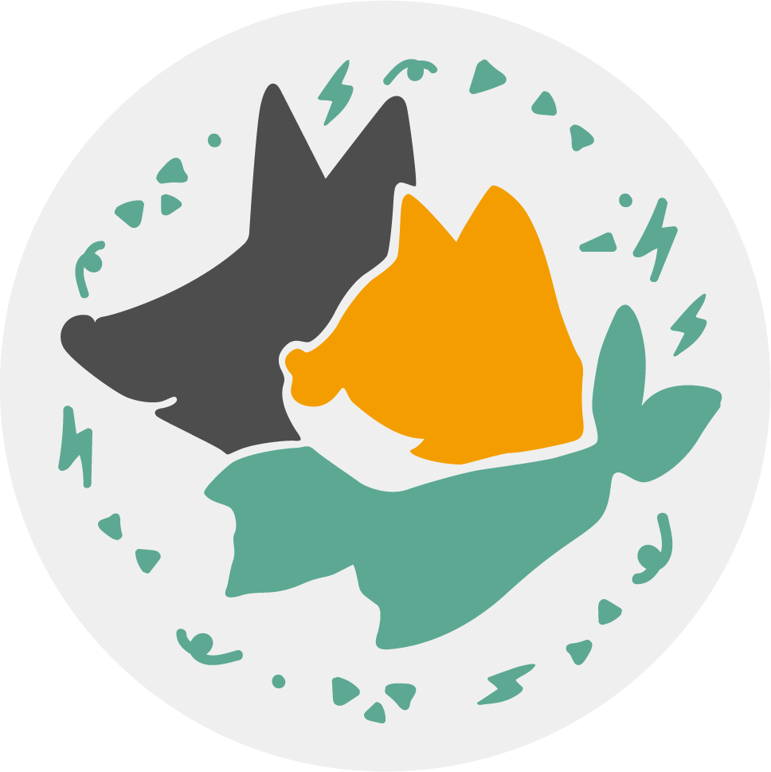

# Closed

It is unfortunate that we received a lot of complaints (ironically) from the supporters of the campaign that we have no rights to open source and aid the election through creative means.
很不幸地，我們收到了很多來自支持者的投訴，指責我們沒有權利以二創手段開源檔案並支援選舉。 這邊只好尊重台灣國情。

<!-- PROJECT LOGO -->
<h1 align="center"> :cat2::dog2:  
PUSS & POOCH 3D Badge [closed]  
 Q版貓狗立體胸章 [3D 列印版 + AR] [ 已下架 ]
</h1>
 

    

<h2>關於 | Info</h2>

Q版貓狗胸章立體化3D列印版本由明上堂有限公司設計提供，檔案版權公開。

The 3D version of the PUSS & POOCH Badge is designed and provided by Mixo Creative studio. The intent is to keep the files open source.

 [註] 明上堂有限公司並非Q版貓狗胸章(2D)的原作者。 
 [*] we do not own the original design of the 2D piece.

<h2>作品集與專頁 | Portfolio</h2>
 
<a href="https://mixocreative.com/ncard/" target="_blank"> ⭐我的網路名片 about me ⭐</a>   
🔽------------------------------------🔽 

歡迎到 [Behance](https://www.behance.net/mixocreative) 瀏覽我的作品集。 
Like my work? Of course you do 😃. 
Have a look at my portfolio at [Behance](https://www.behance.net/mixocreative). 
🔼------------------------------------🔼 

<h2>連絡方式 | Contact</h2>

(<a href="#readme-top">back to top</a>)

<h2>創作目的 | Objective</h2>

將大家喜歡的胸章立體化，公開讓民眾大量3D列印複製自用。

We are transforming the well-loved badge into a three-dimensional design, openly allowing the public to replicate it through 3D printing for personal use.

<h3>理念論述 | Public Diplomacy</h3>

公共外交是設計師的重要命題。對內，創作內容所偏向使用的素材，可塑造市場之審美觀並建構社會的凝聚力。對外，輸出的產品將成為外國人對原產國模糊印象的投射。設計師在建立橋樑、促進理解並推動國家認同方面發揮了不可或缺的作用。

相反，外來的實體也可能試圖通過運用媒體、社交平臺等非軍事手段來干預公眾意見。在保護民主進程的同時，有必要認識並抵制這種外部影響。擁抱本土價值觀和培養認同感是至關重要的對策，有助於增強其民主體制的韌性，減緩外部干預的影響。國家品牌建設，強調自主和在地的重要性，並強化一個國家的獨特優勢和價值觀。

考古和人類學家認為，尼安德塔人由於沒有像智人一樣在族羣之間大量進行文化交流（樂器、雕塑等藝術品等非實用品的交易），導致同類族羣間在進化過程中被邊緣化步向凋零。渡邊靖認為，戰後的日本排脱軸心國的形象，有賴文化輸出莫名其妙地招來的正面評價。可愛的東西不論理由，都總能營造出團結的力量，甚至投射出軟實力。

愛貓愛狗可以是普通市民之間，無分黨派，最大的公約數。 SP Huntington 在文明衝突論中認為，人與人之間最難化解的衝突源自文化圈子(afiliation)之間的身份認同、宗教、利益與政治理念。能夠超越這些圈子的共同興趣/喜好，可以在矛盾之中締造和平的契機。

<h1>為了世界和平，讓我們努力產出有趣的作品吧。</h1>

 
(<a href="#readme-top">back to top</a>)
   
Public Diplomacy has emerged as a significant focal point within the realm of design in academic discourse.  Designers play a pivotal role in not only determining the visual and thematic elements of their creations but also in fostering a sense of unity within the society they engage with. Externally, the resultant products serve as reflective projections that contribute to the formation of indistinct impressions among foreign entities regarding the Country Of Origin. Designers assume an indispensable role in the establishment of cross-cultural connections, facilitation of mutual comprehension, and the active promotion of national identity.

    On the flip side, external entities may endeavor to exert influence on public opinion through non-militaristic avenues. Disinformation and viral marketing have demonstrated their effectiveness in cultivating social distrust towards democracy. The embracement of domestic values is therefore an imperative countermeasures to the impact of external interventions. Nation branding, as a strategic endeavor, underscores the significance of autonomy and locality, thereby reinforcing a nation's distinctive strengths and value.

    According to archaeological and anthropological studies, the Neanderthals, lacking substantial cultural exchanges between cohorts—especially in the trade of non-utilitarian items like instruments and sculptures—succumbed to marginalization in comparison to Homo sapiens. Yasushi Watanabe contends that the post-World War II image of Japan as a nation garnered unexpectedly positive appraisals through the conduits of cultural exports.

    Everybody love pets. We can share common interests irrespective of our beliefs. In alignment with Samuel P. Huntington's Clash of Civilizations theory, it is posited that the most intractable conflicts between individuals emanate from identity, religious affiliations, vested interests, and political ideologies embedded within cultural spheres. Common interests and predilections that traverse these delineated spheres serve as conduits for the reconciliation of discord, thereby a chance for peaceful coexistence amidst prevailing conflicts.

<h3>參考書目 | References</h3>

- Alice Roberts | **The Incredible Human Journey**
- Christopher S. Browning | **Nation Branding and International Politics**
- Francis Fukuyama | **The End of History and the Last Man**
- Harold Lasswell | **Politics: Who Gets What, When, How**
- Joseph S Nye Jr | **Soft Power: The Means To Success In World Politics**
- Keith Dinnie  | **Nation Branding: Concepts, Issues, Practice**
- Simon Anholt | **Brand New Justice: How branding places and products can help the developing world**
- SP Huntington | **Clash of Civilizations**
- 渡辺 靖 | **Soft Power Superpowers: Cultural and National Assets of Japan and the United States**
- 藤原正彦 | **国家の品格**
- 川口盛之助 | **日本人も知らなかった日本の国力**

(<a href="#readme-top">back to top</a>)

<h2> AR 擴充實景 | Augmented Reality</h2>

__胸章的 AR 擴充實景 AUGMENTED REALITY:__

 
:arrow_right: <a href="https://mixocreative.com/ar/?glb-badge_vertical=Q版貓狗胸章-直立&&glb-badge_flat=Q版貓狗胸章-橫放" target="_blank"> 點擊啓動 Try It Out</a> :arrow_left:
 
ℹ️ 請使用chrome瀏覽器啓動頁面。 
ℹ️ Please use chrome browser to launch the AR page.

### 使用説明 | Instructions

1. 模型若有不同顯示選項，將在這裏列出。
2. 支援 __3D AR__ 功能的裝置會顯示 __啟動本機擴充實景 APP__  的按鈕
3. 大部分不支援 __3D AR__ 功能的裝置依然可以瀏覽器上鑑賞3D模型

1. If the model has different display options, they will be listed here.
2. Devices that support 3D AR functionality will display a button to launch the local Augmented Reality (AR) app.
3. Most devices that do not support 3D AR functionality can still view the 3D model in the browser.

(<a href="#readme-top">back to top</a>)

 

 <h2>2D 檔案 | Illustration Files</h2>

 |:open_file_folder: [3D svg 資料夾](svg)        |            | |
| ------------- |:-------------:|:-------------:|
|| [badge.svg](svg) | 插畫的SVG路徑檔 | 

 <h2>3D 列印標的物 | 3D Printables</h2>
  
|:open_file_folder: [3D Print 資料夾](3dprint)        |            | |
| ------------- |:-------------:|:-------------:|
|| [一體式胸章](3dprint/一體式胸章) |一整個列印出來的胸章  Badge in one-piece. | 
|| [組合式胸章](3dprint/組合式胸章) | 份件列印組裝的胸章  Badge printed in parts. | 
|| [胸章模具](3dprint/胸章模具) | 可供翻模用的胸章模具  Mold for the Badge.|  

(<a href="#readme-top">back to top</a>)

<h2>Other Contents | 其他內容</h2>

  | 資料夾         |               | 
| ------------- |:-------------:| 
|:open_file_folder: [3D Print](3dprint)     | 3D 列印 .STL檔案 STL files for 3D printing. |
|:open_file_folder: [blender](blender)      | .blender 檔案 Blender files of the badge design. |
|:open_file_folder: [ar](ar)      | AR 擴充實景 .glb 檔案 AR .glb files for Augmented Reality. |
|:open_file_folder: [svg](svg)      | svg圖檔 SVG file of the illustration. |

(<a href="#readme-top">back to top</a>)

 <h1>可是寶寶不會用 GitHub | Not getting along with GitHub? </h1>

好啦你可以從 [cults3d](https://cults3d.com/:1617577) 平台下載 STL檔案。 
 No worries, we got you back. You can download the STL files from [Cults3D](https://cults3d.com/:1617577)
 

(<a href="#readme-top">back to top</a>)

