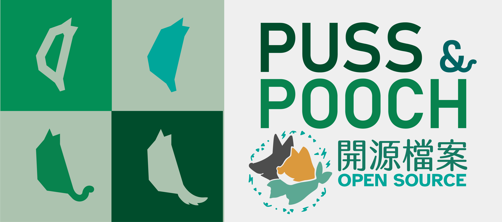

<!-- PROJECT LOGO -->
<h1 align="center">PUSS & POOCH :cat2::dog2: Q版貓狗胸章</h1>
 

  
  

  <!-- ABOUT THE PROJECT -->
## About The Project

[![Product Name Screen Shot][product-screenshot]](https://example.com)

Here's a blank template to get started: To avoid retyping too much info. Do a search and replace with your text editor for the following: `github_username`, `repo_name`, `twitter_handle`, `linkedin_username`, `email_client`, `email`, `project_title`, `project_description`

(<a href="#readme-top">back to top</a>)

 

<h3>內容</h3>

  | 資料夾         |               | 
| ------------- |:-------------:| 
| [3D Print](3D%20Print)     | 3D 列印 .STL檔案 |
| [img](img)      | 各種圖檔 |
| [blender](blender)      | .blender 檔案 |
| [ar](ar)      | AR 擴充實景 .glb 檔案 |

 <h3>3D Printables 3D 列印標的物</h3>
  
| [3D Print 資料夾](3D%20Print)        |            | 
| ------------- |:-------------:|
| [一體式胸章](3d%20print/一體式胸章)  |一整個列印出來的胸章 | 
| [組合式胸章](3D%20Print/組合式胸章)      | 份件列印組裝的胸章 | 
| [胸章模具](3D%20Print/胸章模具)| 可供翻模用的胸章模具  |   

  <!-- CONTACT -->
## Contact

Your Name - [@twitter_handle](https://twitter.com/twitter_handle) - email@email_client.com

Project Link: [https://github.com/github_username/repo_name](https://github.com/github_username/repo_name)

(<a href="#readme-top">back to top</a>)

